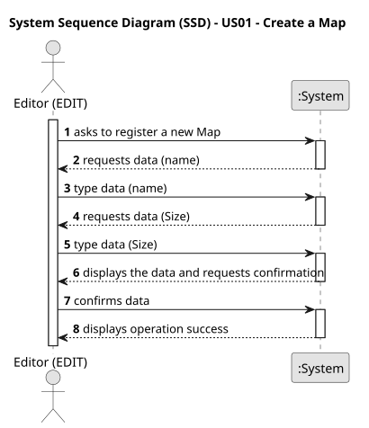

# US01 - Create a Map

_XXX stands for User Story number and YYY for User Story description (e.g. US006 - Create a Task)_

## 1. Requirements Engineering

### 1.1. User Story Description

As an Editor, I want to create a map with a size and a name.

### 1.2. Customer Specifications and Clarifications 

**From the specifications document:**

> Maps can only be created by a Editor.

**From the client clarifications:**

> **Question:**

>Are there minimum and maximum values for size?

>Are there standard ratio or max/min ratio for map size?

> **Answer:** The number needs to be a positive on; there is no maximum, it's up to the editor to decide.

> **Question:**

    What are the minimum and maximum dimensions allowed for a map (e.g., width and height in units or pixels)?
    Is there a predefined list of sizes, or should users be able to input custom dimensions?
    Are there any requirements or restrictions for the map's name (e.g., character limit, allowed/disallowed characters)?
    Should map names be unique within the system?

>

> **Answer:**
Should be positive integer;
Custom dimensions but suggesting predefined sizes could be a good idea.
File name like restrictions.
yes.
.

### 1.3. Acceptance Criteria

* **AC1:** The maps dimensions are positive integers.
* **AC2:** Map name should be a valid file name.

### 1.4. Found out Dependencies

* n/a

### 1.5 Input and Output Data

**Input Data:**

* Typed data:
    * Size
    * Name

**Output Data:**

* (In)Success of the operation
### 1.6. System Sequence Diagram (SSD)

### 1.7 Other Relevant Remarks

* n/a