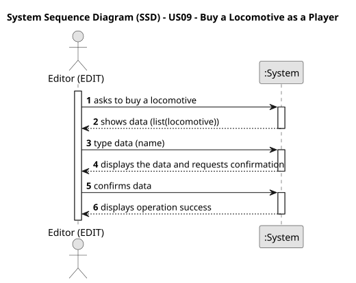

# US09 - Buy a Locomotive as a Player

## 1. Requirements Engineering

### 1.1. User Story Description

As a Player, I want to buy a locomotive.

### 1.2. Customer Specifications and Clarifications 

**From the specifications document:**

> A player should be able to buy a locomotive.

**From the client clarifications:**

> **Question:**
>Verifiquei que na US em referencia existe uma dependencia referente a uma lista de locomotivas disponíveis para o cenário e data atual. No entanto, não encontrei nenhuma User Story específica que trate da construção ou exibição dessa lista. Essa funcionalidade de listagem será detalhada em uma US futura?

> **Answer:** The locomotives that will be presented in the selection list are restricted to the current date and any restrictions that may have been defined in the scenario.
The presentation of the list of locomotives is part of US09.

> **Question:** Is there a limit to how many trains a player can own, like a inventory that can get full?

> **Answer:** there is no physical limit, just the available memory.

> **Question:** Can a player buy the same train multiple times?

> **Answer:** the same type of locomitve, yes; but these locomotives will have unique identification (like a plate or a serial number)

### 1.3. Acceptance Criteria

* **AC1:** The player should choose the locomotive from a list of available locomotives for the scenario as well as a current date.

### 1.4. Found out Dependencies

* n/a

### 1.5 Input and Output Data

**Input Data:**

* Typed data:
    * name

**Output Data:**

* (In)Success of the operation
* 
### 1.6. System Sequence Diagram (SSD)

### 1.7 Other Relevant Remarks

* n/a