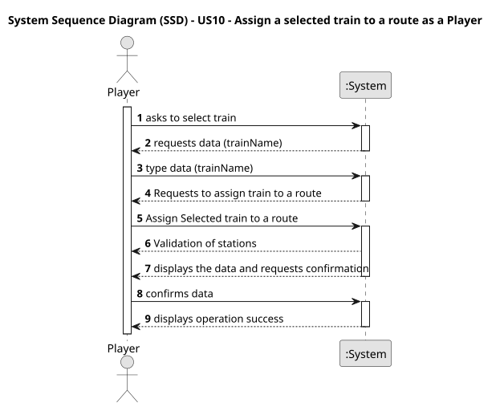

# US10 - Assign a selected train to a route as a Player

## 1. Requirements Engineering

### 1.1. User Story Description

As a Player, I want to assign a selected train to a route with
valid stations and the respective list of cargoes to be picked up in each
station

### 1.2. Customer Specifications and Clarifications 

**From the specifications document:**

> Players should be able to assign a selected train to a route.

**From the client clarifications:**

> **Question:** A route is a list of stations where the train passes. If there is many stations but no railway lines, are we able to create a route?

> **Answer:**
If there is no path between any pair of consective points of the route, the player should be warned, then the player can opt between cancel/proceed.

### 1.3. Acceptance Criteria

* **AC1:** If there is no path between any pair of consective points of the route, the player should be warned, then the player can opt between cancel/proceed.

### 1.4. Found out Dependencies

* There is a dependency on " US05 - As a Player, I want to build station " as there must be at least one station created.

### 1.5 Input and Output Data

**Input Data:**

* Typed data:
    * trainName
    * stationName
    * cargoeName

**Output Data:**

* (In)Success of the operation
### 1.6. System Sequence Diagram (SSD)

### 1.7 Other Relevant Remarks

* n/a