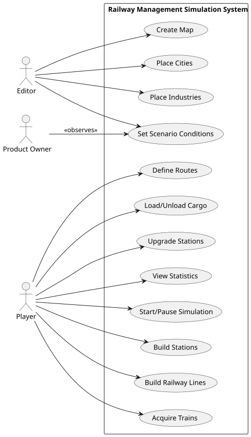

# OO Analysis

The construction process of the domain model is based on the client specifications, especially the nouns (for _concepts_) and verbs (for _relations_) used. 

## Rationale to identify domain conceptual classes
To identify domain conceptual classes, start by making a list of candidate conceptual classes inspired by the list of categories suggested in the book "Applying UML and Patterns: An Introduction to Object-Oriented Analysis and Design and Iterative Development". 

### _Conceptual Class Category List_

**Business Transactions**

* Train Purchase
* Cargo Transport
* Station Construction
* Line Construction
---

**Transaction Line Items**

* Cargo Load
* Cargo Unload
* Station Upgrade
* Route Assignment

---

**Product/Service related to a Transaction or Transaction Line Item**

* Locomotive
* Carriage
* Train Route
* Station Building
* Track Segment

---

**Transaction Records**

* Transport Log
* Construction Record
* Event Log

---  

**Roles of People or Organizations**

* Player
* Editor
* Product Owner

---

**Places**

* City
* Industry
* Port
* Station

---

**Noteworthy Events**

* Historical Event (e.g. War, Vaccination Campaign)
* Train Departure
* Train Arrival
* Cargo Delivery

---

**Physical Objects**

* Train
* Locomotive
* Carriage
* Station
* Track
* Building (e.g. Post Office, Café)

---

**Descriptions of Things**

* Locomotive Type (Steam, Diesel, Electric)
* Carriage Type (Passengers, Mail, Coal, etc.)
* Station Type (Depot, Station, Terminal)
* Industry Type (Primary, Transforming, Mixed)

---

**Catalogs**

* Locomotive Catalog
* Carriage Catalog
* Industry Catalog
* Event Catalog

---

**Containers**

* Map
* Scenario

---

**Elements of Containers**

* City
* Industry
* Track Segment
* Station

---

**(Other) Organizations**

* Game Development Organization (via Product Owner)

---

**Other (External/Collaborating) Systems**

(None explicitly mentioned, but could include)
* External economic simulators
* Multiplayer network system (future)

---

**Records of finance, work, contracts, legal matters**

* Budget
* Maintenance Cost Log
* Acquisition Records

---

**Financial Instruments**

* Budget (In-game currency)

---

**Documents mentioned/used to perform some work**

* Scenario Configuration
* Map Configuration

---

## Rationale to identify associations between conceptual classes

An association is a relationship between instances of objects that indicates a relevant connection and that is worth of remembering, or it is derivable from the List of Common Associations: 

| Concept (A) 	            |    Association    |  Concept (B) |  
|--------------------------|:-----------------:|-------------:|
| Player             |       manages	        |          Train |
| Player  	          | creates   	  |      Route |
| Route  	          |      includes   	      |        Station |
| Train  	                  |    uses  	    | Locomotive |
| Train  	                  |  pulls  	   |       Carriage |
| Station  	                |  located in  	   |         City |
| Station     |     serves     |          Industry |
| Station   |       upgraded with        | Building |
| Scenario     |     contains     | Map |     
| Scenario     |     defines     |        Time Restrictions |
| Scenario     |     defines     |         Technological Restrictions |
| Scenario     |  defines   | Historical Event |
| Train      | travels on |      Railway Line |
| Railway Line      |     connects     |      Station |
| City      |  generates   | Passengers, Mail |
| Industry                  |       produces        |      Cargo |
| Cargo |      stored at      | Station |

## Domain Model

**Do NOT forget to identify concept atributes too.**

**Insert the Domain Model diagram in SVG format below.**

